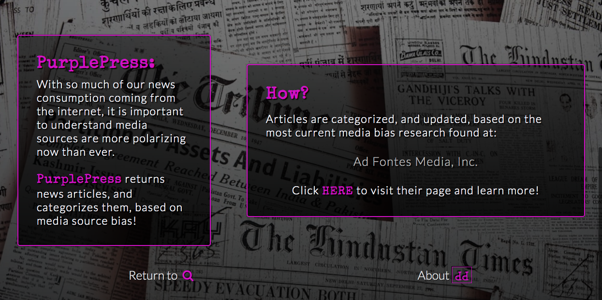

# PurplePress App

A news app which allows users to search for specific topics, or top news of the day, and displays article results based on the article source's bias.

## Summary

PurplePress allows users to access news articles, based on any given search term, by utilizing the News API (https://newsapi.org/), along with the Unsplash API (https://unsplash.com/documentation#search-photos), and returning 3 lists of results representing conservative, liberal, and neutral media sources.  Users are then able to peruse each list, as well as learn about how the results are determined.  

## Screenshots
Search Screen/Landing Page:

About:

Results:

Error:

## Technologies 

HTML/CSS/JavaScript/jQuery

## Demo

- [Live Demo](https://jdeardsjr.github.io/PurplePressApp/)

